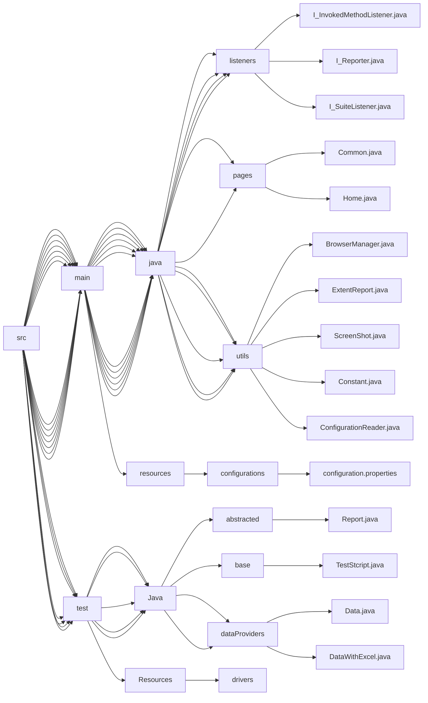

# TestNG and Selenium framework with java
## Framework file strucuture


## Driver flow(Multi browser)
```mermaid 
flowchart TD;

Testng.xml-->browserName-->ConfigurationReader-->Browser.setProperty-->Common.driver
Testng.xml-->browserName1-->ConfigurationReader-->Browser.setProperty-->Common.driver